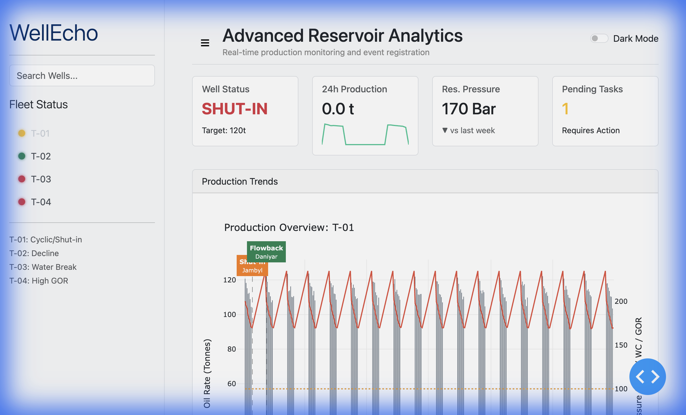
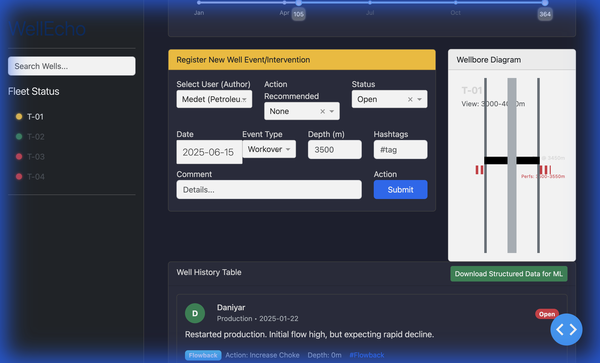

# WellEcho - Advanced Reservoir Analytics

**WellEcho** is a next-generation reservoir management dashboard designed for high-density intelligence monitoring. It transforms traditional data tables into an interactive "Cockpit" for engineers and geologists.

## 🚀 Key Features

*   **Interactive Cockpit**: Real-time monitoring of fleet status with instant visual feedback.
*   **Production Analytics**: Dynamic charts with range sliders for historical trend analysis (Oil Rate, Pressure, Water Cut, GOR).
*   **Social Activity Feed**: A modern, social-media style feed for well events, interventions, and comments.
*   **Wellbore Schematic**: Live visual representation of completion hardware (Packers, SSDs, Perforations).
*   **Dark Mode**: sleek, high-contrast UI for low-light environments.

## 📸 Screenshots

### Light Mode (Standard View)


### Dark Mode (High Contrast)


## 🛠️ Getting Started

### Prerequisites
- Python 3.9+
- pip

### Installation

1.  **Clone the repository**
    ```bash
    git clone https://github.com/ikussanov91/well_utility_demo.git
    cd well_utility_demo
    ```

2.  **Run the Setup Script**
    This script creates a virtual environment and installs dependencies.
    ```bash
    bash setup.sh
    ```

3.  **Run the App**
    ```bash
    source .venv/bin/activate
    python app.py
    ```
    Open your browser at `http://127.0.0.1:8051`.

## 🏗️ Built With
- **Dash / Plotly**: For interactive web components and charting.
- **Dash Bootstrap Components**: For responsive layout and styling.
- **Pandas**: For data manipulation and physics simulation.

---
*Created by [Ilyas Kussanov](https://github.com/ikussanov91)*
